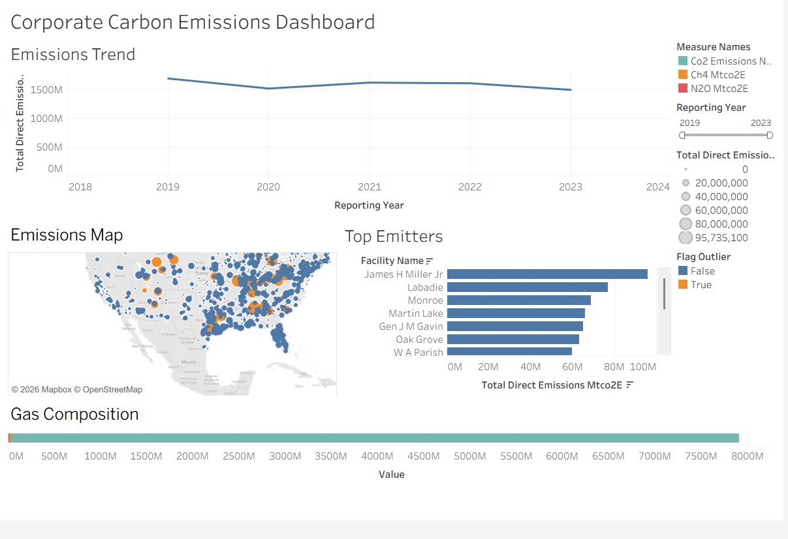

# Corporate Carbon Emissions Analytics Dashboard

Facility-level greenhouse gas emissions analysis of the U.S. Power Plants sector using real EPA Greenhouse Gas Reporting Program (GHGRP) data from 2019–2023.

The project combines a Python-based ETL and data-quality pipeline with an interactive Tableau dashboard to analyze direct emissions trends, identify high-emitting facilities, examine greenhouse gas composition, and visualize the geographic distribution of reported emissions.

---

## Overview

Corporate sustainability and ESG reporting increasingly requires organizations to understand where emissions originate, how they change over time, and how reported emissions map to established GHG accounting boundaries.

This project analyzes facility-level emissions reported to the **U.S. Environmental Protection Agency (EPA)** through the **Greenhouse Gas Reporting Program (GHGRP)**.

The analysis focuses on the **Power Plants sector** and answers four core questions:

- How have reported direct emissions changed from 2019–2023?
- Which facilities are the largest direct emitters?
- What is the composition of reported emissions across CO₂, CH₄, and N₂O?
- Where are major emitting facilities geographically concentrated?

The project also explicitly addresses the boundary between **Scope 1, Scope 2, and Scope 3 emissions** rather than assigning unsupported scope classifications to data that does not contain the required information.

---

## Key Results

| Metric | Result |
|---|---:|
| **Analysis Period** | 2019–2023 |
| **Facility-Year Records** | 6,701 |
| **Unique Facilities** | 1,419 |
| **2019 Direct Emissions** | 1.69B mtCO₂e |
| **2023 Direct Emissions** | 1.49B mtCO₂e |
| **Overall Change** | **−11.7%** |
| **Outlier Records Flagged** | 171 |
| **Missing/Non-positive Emissions Records** | 50 |
| **Duplicate Facility-Year Records** | 0 |

Reported direct emissions declined by approximately **11.7%** between 2019 and 2023, falling from **1.69 billion mtCO₂e to 1.49 billion mtCO₂e**.

The time series shows a decline in 2020, a partial rebound in 2021, followed by continued declines through 2022 and 2023.

---

## Data Source

Data is sourced from the **U.S. Environmental Protection Agency (EPA) Greenhouse Gas Reporting Program (GHGRP)** yearly Data Summary Spreadsheets.

**Source:** EPA GHGRP Data Sets
https://www.epa.gov/ghgreporting/data-sets

### Dataset Scope

- **Sector:** Power Plants
- **Years:** 2019, 2020, 2021, 2022, 2023
- **Source sheet:** `Direct Point Emitters`
- **Final processed records:** 6,701 facility-year observations
- **Unique facilities:** 1,419

The five yearly EPA files were combined and filtered into a single analysis-ready dataset:

```text
data/processed/emissions_clean.csv
```

---

## Methodology

### ETL Pipeline (`src/etl.py`)

1. **Load** — read the combined yearly EPA workbooks from `data/raw/`.
2. **Standardize** — normalize all column headers to snake_case via an alias map, since GHGRP's yearly exports don't use identical header names across years/tools.
3. **Coerce** — convert emissions and coordinate fields to numeric; invalid values become `NaN` rather than silently breaking downstream steps.
4. **Flag, don't hide** — rows with missing or non-positive reported emissions, duplicate facility-year rows, and statistical outliers (`|z| > 3` within sector) are tagged with boolean flag columns and *kept* in the output, not dropped. This preserves a visible audit trail rather than quietly discarding data.
5. **Drop only what can't be attributed** — the single hard drop rule is rows with no `facility_id`, since those can't be tied to any real facility.

### Scope Classification (`src/scope_classifier.py`)

GHGRP is a **Scope 1 (direct emissions)** dataset by design — it does not report facility electricity purchases or supply-chain data. Rather than fabricate Scope 2/3 figures the source data can't support, this project:

- Labels every record explicitly as **Scope 1**, reported directly to EPA.
- Adds a small, clearly-flagged **illustrative Scope 2 estimate** for a handful of sample facilities, using published EPA eGRID regional grid emission factors, to demonstrate the Scope 1/Scope 2 boundary — not to estimate Scope 2 for the full dataset.
- Labels **Scope 3 explicitly out of scope**, since GHGRP contains no supply-chain or value-chain emissions data. This is a genuine boundary of the source data, not something a larger pipeline can paper over.

Every number in the dashboard can be traced back to exactly how it was derived.

---

## Dashboard

**[Corporate Carbon Emissions Dashboard — Tableau Public](https://public.tableau.com/app/profile/vedant.mishra4070/viz/Book1_17887141073150/CorporateCarbonEmissionsDashboard)**



The dashboard is built directly against `data/processed/emissions_clean.csv` and includes:

1. **Emissions Trend** — total reported direct emissions by year (2019–2023).
2. **Top Emitters** — the 20 highest-emitting facilities by total reported emissions.
3. **Gas Composition** — CO₂ / CH₄ / N₂O breakdown of reported emissions.
4. **Emissions Map** — geographic distribution of facilities, sized by total emissions and colored by outlier status, with an interactive Reporting Year filter.

A methodology note on the dashboard clarifies that all facility data shown is Scope 1 (direct) per EPA GHGRP; Scope 2 is illustrated only for a small sample using eGRID factors; and Scope 3 is out of scope for this dataset.

---

## Tech Stack

Python (pandas, numpy) · Jupyter · Tableau

---

## Limitations & Next Steps

- **Scope 2** is only estimated illustratively for a small sample of facilities; a full Scope 2 estimate across all 1,419 facilities would require actual electricity purchase data, which GHGRP does not report.
- **Scope 3** estimation would require supply-chain data not available in GHGRP; a natural extension would be layering in CDP supply-chain disclosures for facilities whose parent companies report to CDP.
- Outlier flags are statistical (`|z| > 3`), not investigated case-by-case — a next iteration could cross-reference flagged facilities against EPA's public enforcement or facility-change records to distinguish real anomalies from data entry issues.
- This analysis is scoped to the Power Plants sector only; extending to Petroleum & Natural Gas Systems or Chemicals would allow cross-sector comparison.